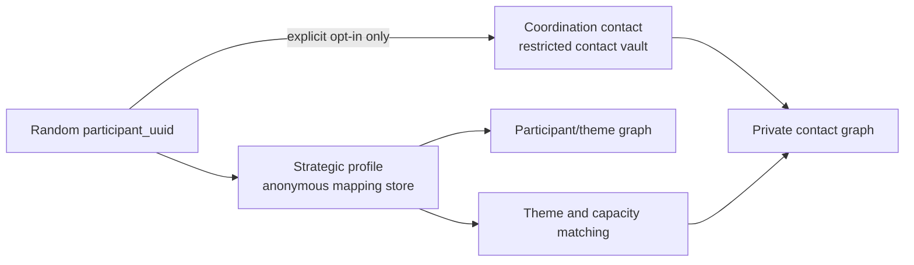
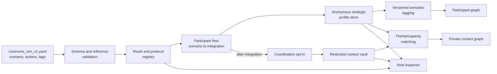

# Questioning the Commons — Mapping and Coordination Plan

Status: smoke MVP implemented; scenario wording remains provisional
Target workspace: `app_protocol_hack`
Source inspected: sibling `app_iceicebaby`, branch `rc0`, committed baseline through `2078b80`
Source verification: 31 focused interaction, registry, flow, and overview tests pass

Bootstrap checkpoint, 2026-07-22:

- the `Protocol Hack` database parent page exists;
- eight `protohack_*` databases are verified, with the strategic-to-contact relation deliberately removed;
- inactive draft session `commons_pilot_2026` is seeded;
- database IDs are recorded in `config/protohack_notion.json`;
- creation, v2 reconciliation, and verification logic lives in `scripts/bootstrap_protohack_notion.py`;
- the one-scenario participant flow, public map, protected host view, and contact-only deletion are implemented;
- focused automated tests plus desktop/mobile browser checks cover the participant and host paths.

## 1. Fundamental product decision

The app has two distinct product layers:

1. **Mapping** — produces an anonymous strategic map of the ecosystem.
2. **Coordination** — optionally makes that map actionable by inviting participants into future contact.

They must feel continuous to the participant but remain separate in purpose, consent, storage, access, deletion, and export.

The MVP is not a survey. It is an engine that transforms:

```text
Scenario
  -> Strategic decision
  -> One-sentence rationale
  -> Semantic tags
  -> Anonymous participant graph
  -> Optional contact graph
```

The participant graph tells us how people think strategically.

The contact graph tells authorised coordinators who may be willing to work together.

The graphs become useful when linked through shared or complementary themes, capacities, and constraints—not merely because two participants selected the same answer.

## 2. Product promise

The product is a:

> **Scenario-based strategic mapping instrument with a separate, explicit coordination layer.**

For the first smoke test, it contains only one scenario decision. The participant:

1. sees a scenario and a clear notice that there is no right or wrong answer;
2. can continue, flag, or skip each question;
3. makes one strategic decision;
4. explains the decision in one sentence or skips with a reason;
5. reviews and may revise the trajectory;
6. saves a textual return key and confirms the integration;
7. explicitly integrates it into the Commons Map;
8. sees a successful integration celebration;
9. is invited, separately, to opt into future coordination.

This is intentionally smaller than the later multi-turn simulation. It is already sufficient to prove the mapping/coordination architecture and generate a first ecosystem map.

## 3. Two outputs

### Output A — Commons ecosystem map

Always produced after explicit integration.

Contains only pseudonymous strategic data:

- random `participant_uuid`;
- scenario, decision, and action IDs;
- one-sentence rationale;
- semantic themes;
- capacities mobilised or prioritised;
- constraints and resources implicated;
- integration timestamp and protocol version;
- no name, email, affiliation, or other direct contact field.

Purpose:

- show strategic orientations;
- expose shared and complementary themes;
- identify missing capacities and ecosystem gaps;
- reveal clusters, bridges, tensions, and alternative pathways;
- support aggregate and graph analysis.

### Output B — Coordination graph

Produced only for explicit opt-ins after Output A has been integrated.

Contains:

- the same random `participant_uuid` bridge;
- coordination consent and consent version;
- contact fields supplied voluntarily;
- preferred language and interaction format when collected;
- availability when collected;
- coordination themes derived from the already-integrated strategic profile.

Purpose:

- identify small groups around shared interests or complementary capacities;
- support human-mediated invitations;
- make the ecosystem map actionable without turning the public map into a contact directory.

Output B is private to authorised coordinators. Contact information never appears in the public or analytical ecosystem map.

## 4. Participant flow

### Step 0 — Orientation

Explain:

- this is a scenario, not a test;
- there is no correct answer;
- the participant is choosing a strategy under incomplete information;
- the strategic response is anonymous by default;
- contact information is requested only after map integration and only for optional coordination.

Working notice:

> There is no right or wrong answer. We are interested in the strategy you choose and why.

### Step 1 — Smoking-gun scenario

Present exactly one scenario and one bounded strategic decision.

The exact scenario wording and action choices are intentionally not fixed in this plan. They are the next design task.

Semantic identities:

```text
SCN_001 -> DEC_001 -> ACT_*
```

### Step 2 — Rationale

Immediately ask:

> Why did you choose this?

Helper:

> One sentence.

This is part of the strategic profile, not coordination data.

### Step 3 — Review and revise

Show the participant:

- the scenario;
- selected action;
- one-sentence rationale;
- an explicit `Revise` action;
- an explicit `Review integration` action.

The response remains a draft until integration. No strategic profile appears in the map or graph before the participant integrates it.

`Review integration` opens the `Save this key` confirmation dialog. It must show, before any write:

- the short four-symbol emoji alias;
- the complete UUID textual return key, in a copyable text block;
- the complete SHA-256 verification hash, without truncation;
- the selected move and rationale, or the fact that the rationale was skipped.

The emoji alias is a convenience, not the only access mechanism. The full textual key is the laptop-safe return mechanism.

### Step 4 — Integrate

`Confirm and integrate` inside the confirmation dialog performs one atomic strategic-profile write. Opening or closing the dialog performs no strategic write.

It creates:

- `participant_uuid` if one does not exist;
- strategic decision record;
- rationale;
- deterministic semantic tags;
- protocol/tagger version;
- integration timestamp.

Integration is independent of later coordination consent. Declining or abandoning the coordination step never removes the integrated strategic profile.

After a successful write, and only after it succeeds, the participant is taken to Mapping completion and balloons are always shown once. A failed write retains the draft and shows no success celebration.

### Standard question controls — initial contract

Every normal participant question exposes the same three actions:

1. `Continue` validates and advances;
2. `Flag` opens inline feedback without advancing;
3. `Skip` opens a confirmation dialog and advances only after a reason is supplied.

The feedback vocabulary is systematic across questions:

- interesting question;
- useful for coordination;
- incomplete;
- misleading;
- too narrow;
- unclear;
- missing option.

A flag accepts one or more reasons and/or an optional note. A skip requires at least one reason or a note. Feedback is written anonymously to `protohack_Events`, independently of strategic integration and contact consent. Skipping the smoking-gun decision creates no strategic profile; skipping only the rationale records that absence and still permits explicit review and integration.

### Step 5 — Mapping completion

Replace a generic “Thank you” screen with:

> **Your trajectory has been added to the Commons Map.**

Then ask:

> **Would you like to help build the next step?**

This is the boundary between Mapping and Coordination.

### Step 6 — Coordination invitation

Smoke-test question:

> Would you be interested in discussing strategy with other participants?

- `Yes`
- `Not now`

If `Yes`, the smoke test asks only:

- email — optional.

The fuller coordination layer may later collect:

- name — optional;
- affiliation or organisation — optional;
- preferred language(s);
- availability;
- preferred format:
    - informal discussion;
    - working group;
    - future project;
    - research collaboration.

Working completion copy:

> We’ll contact you when a small group emerges around shared interests.

If `Yes` is submitted without a reachable contact field, the record represents anonymous demand for coordination only. The interface must state that the team cannot contact the participant unless another authorised channel exists.

## 5. User-facing privacy explanation

The storage boundary must be visible in plain language before contact information is entered.

Working copy:

> Your strategy is stored under a random participant code, separately from your contact details. If you later ask us to delete your contact details, your anonymous strategy can remain part of the Commons Map. Contact details are not shown on the map and are not shared with other participants without further permission.

The participant interface shows the complete textual UUID return key and full verification hash in the private confirmation and completion views. Neither value appears on the public map. Email is never used as the identifier.

This promise is valid only if the technical and access-control separation below is implemented and verified.

## 6. Data separation and UUID bridge



### Bridge identifier

`participant_uuid` is:

- random and opaque;
- generated independently of email, name, access key, organisation, or answer;
- stored in both datasets only when coordination consent exists;
- never a public graph label;
- the only application-level bridge between strategic and contact data.

Recommended implementation: UUIDv4 generated locally at first integration.

### Strategic dataset

Stored in `protohack_Responses`.

Contains:

- `participant_uuid`;
- `scenario_id`;
- `decision_id`;
- `action_id`;
- `rationale`;
- `semantic_tags_json`;
- `tagger_version`;
- `strategic_profile_json`;
- `integration_status`;
- `integrated_at`;
- `protocol_version`;
- revision and provenance metadata.

Must not contain:

- name;
- email;
- organisation;
- languages when they are collected only for coordination;
- availability;
- coordination preferences;
- raw access key;
- a populated database relation to the contact record.

### Coordination contact vault

Stored in `protohack_Players` for the MVP, subject to the access-control decision below.

Contains:

- `participant_uuid`;
- `coordination_opt_in`;
- `coordination_consent_version`;
- `coordination_consented_at`;
- email — optional;
- name — optional;
- affiliation — optional;
- languages;
- availability;
- preferred formats;
- withdrawal or deletion timestamp;
- coordinator notes only if explicitly governed.

Must not contain the scenario rationale or complete strategic profile.

### Relation cleanup — implemented

The inherited `protohack_Responses.player` relation has been removed from the live schema and from the reusable bootstrap. `participant_uuid` is now the only bridge. Repository contract tests ensure a strategic write contains neither a player relation nor an email field.

### Deletion behavior

Required independent operations:

- delete or anonymise the coordination record without altering the strategic profile;
- demonstrate that no contact field remains in mapping exports or logs;
- break coordination lookup after withdrawal;
- retain the anonymous strategic profile only under the consent/retention policy approved before launch.

For this pilot, participants may delete contact data only. The anonymous strategic profile remains.

## 7. Access-control boundary

Separate tables are necessary but not sufficient for privacy.

Current state:

- `protohack_Responses` and `protohack_Players` are separate databases;
- both currently live under the same `Protocol Hack` database parent page;
- parent-level permissions may therefore expose both to the same people.

The pilot decision is application-enforced separation:

### Deferred — Restricted contact vault

- move or recreate `protohack_Players` under a restricted database parent;
- share it only with the application connection and authorised coordinators;
- allow analysts to access only the strategic dataset or privacy-safe exports.

### Implemented — Application-enforced separation

- retain the current database location;
- restrict the entire parent page to the smallest possible team;
- expose strategic analysis only through privacy-safe exports;
- ensure host and overview pages never render contact fields;
- document that separation is logical rather than permission-isolated.

The user-facing statement “stored separately” must describe the option actually implemented.

## 8. Mapping semantics

The engine converts a decision into a versioned strategic profile.

### Semantic object IDs

| Prefix | Object                                 | Example   |
| ------ | -------------------------------------- | --------- |
| `SCN_` | Scenario                               | `SCN_001` |
| `DEC_` | Decision point                         | `DEC_001` |
| `ACT_` | Available action                       | `ACT_001` |
| `RES_` | Resource theme                         | `RES_001` |
| `CAP_` | Capacity theme                         | `CAP_001` |
| `OUT_` | Outcome, reserved for later simulation | `OUT_001` |

Rules:

- IDs are stable and zero-padded to three digits in version 1;
- semantic changes create a new ID or protocol version;
- analytics use IDs, never display labels;
- every reference resolves during YAML validation;
- the inherited `question_id` field may mirror `decision_id` temporarily, but new domain code calls it `decision_id`.

### Semantic tag sources

For the smoke test, use deterministic, authored tags:

- scenario declares its contextual themes;
- each action declares its strategic orientation;
- each action declares capacities mobilised or prioritised;
- each action declares implicated resource types and constraints;
- the one-sentence rationale is stored verbatim but is not automatically classified by an external model.

This gives a reproducible first graph without pretending that one sentence has been reliably interpreted by automation.

Later, rationale tagging may be:

- manually reviewed;
- rule-based;
- model-assisted with a visible version and confidence;
- participant-confirmed before graph integration.

The tagging method is a protocol choice and must always store `tagger_version` and provenance.

## 9. Actors, capacities, and resources

The strategic map should not collapse actors into actions.

```text
Actor
  -> provides capacities
  -> accesses or controls resources
  -> faces constraints
  -> can contribute to actions
```

Capacity families may include:

- local or situated knowledge;
- scientific evidence and synthesis;
- facilitation and conflict mediation;
- maintenance and care;
- mobilisation and outreach;
- software, automation, and tooling;
- material infrastructure;
- funding and procurement;
- monitoring and evaluation;
- rule-making and enforcement;
- institutional legitimacy;
- political legitimacy;
- visibility and narrative power;
- coordination and convening;
- time and sustained attention.

Resource types remain explicit:

- human;
- technical;
- knowledge;
- institutional;
- social;
- economic;
- time;
- political.

Institutional legitimacy and political legitimacy remain distinct. An actor may possess one without the other.

The single smoke-test scenario needs only the smallest subset of this taxonomy required to distinguish its actions meaningfully.

## 10. Participant graph

The analytical graph is pseudonymous and may be represented as a bipartite or heterogeneous graph.

### Node types

- anonymous participant UUID;
- semantic theme;
- capacity;
- resource type;
- constraint;
- scenario/action when analytically useful.

### Edge types

- participant selected action;
- participant expressed theme;
- action mobilises capacity;
- action implicates resource;
- participant rationale references a reviewed theme;
- themes complement or conflict with other themes.

### Matching principle

Do not connect participants only because they chose the same action.

Potential matches should consider:

- shared themes with different strategic approaches;
- complementary capacities;
- common constraints;
- one participant’s offered capacity matching another’s bottleneck;
- language and format compatibility, but only inside the coordination layer;
- deliberate diversity rather than maximum similarity.

For the smoke test, the graph may use authored action tags only. Matching can remain an operator-visible preview rather than an automated invitation system.

## 11. Contact graph

The contact graph is private and contains only opted-in participants.

It should represent:

- willingness to coordinate;
- reachable versus anonymous interest;
- preferred language and format when collected;
- candidate groupings produced from strategic themes/capacities;
- invitation and contact status when coordination begins.

It must not:

- expose email addresses to other participants automatically;
- become a public directory;
- treat identical answers as sufficient grounds for a match;
- send communication without a separate authorised workflow;
- imply that opt-in guarantees contact or inclusion in a group.

Recommended first operating model: host-mediated contact. The team contacts an opted-in participant when a credible small group emerges. Direct participant-to-participant disclosure requires further consent.

## 12. Protocol specification

`protocol/specs/commons_smoke_v1.yaml` remains the durable source for the mapping protocol and its initial interaction guarantees.

For the smoke test it needs only:

```yaml
id: commons_smoke
version: 0.2.0-draft
interaction:
    question_actions: [continue, flag, skip]
    feedback_profile: iceicebaby-v1
    skip_requires_reason: true
    confirmation_before_integration: true
    show_textual_return_key: true
    show_full_verification_hash: true
    balloons_after_integration: true
scenario:
    id: SCN_001
    decision:
        id: DEC_001
        actions: [...]
rationale_id: RAT_001
```

Later versions may add actors, latent state, uncertainty, outcomes, transitions, and delayed effects without changing the Mapping/Coordination privacy boundary.

## 13. Runtime architecture



The participant page never writes directly to database. It submits validated strategic and coordination commands to separate repository methods.

Required write boundary:

- `integrate_strategic_profile(...)` writes only Output A;
- `record_coordination_consent(...)` writes only Output B;
- neither method accepts fields belonging to the other dataset.

## 14. Route identity

Working defaults:

```yaml
route:
    public_path: /commons
    campaign_slug: questioning_commons
    event_slug: commons_inquiry
    session_code: commons_pilot_2026
    text_id: commons_sim_v1
    question_set_id: commons_sim_v1 # inherited registry compatibility
    simulation_id: commons_sim_v1
    protocol_version: commons_smoke_v1
    schema_id: mapping_coordination_v1
    response_scope: event_session
    lifecycle: draft
    title: Questioning the Commons
```

Every strategic write and coordination write must carry matching route/session/protocol identity. Unknown or mismatched identity fails visibly.

## 15. Product surfaces

| Surface              | Route            | Responsibility                                                                           |
| -------------------- | ---------------- | ---------------------------------------------------------------------------------------- |
| Landing              | `/`              | Explain the scenario, mapping, optional coordination, and privacy boundary               |
| Participant          | `/commons`       | Scenario, decision, rationale, revision, integration, optional contact                   |
| Commons Map          | `/commons-map`   | Strategic profiles and ecosystem graph only; no contact fields                           |
| Host                 | `/commons-host`  | Protocol source, strategic records, private coordination operations, logs                |
| Smoke-test reference | `/test-smokegun` | Preserved first local participant interface, isolated under the Tests navigation section |

The host interface must visually separate:

- Map data;
- Coordination data;
- match candidates;
- consent/deletion operations.

Contact fields should never appear in general diagnostics or logs.

## 16. Storage migration plan

### `protohack_Responses` — anonymous mapping store — migrated

Add:

- `participant_uuid` rich text;
- `scenario_id` rich text;
- `decision_id` rich text;
- `action_id` rich text;
- `rationale` rich text;
- `semantic_tags_json` rich text;
- `tagger_version` rich text;
- `strategic_profile_json` rich text;
- `integration_status` select;
- `integrated_at` date;
- `protocol_version` rich text;
- `revision` number.

Removed:

- `player` relation.

### `protohack_Players` — coordination store — migrated for the smoke pilot

Add:

- `participant_uuid` rich text;
- `coordination_opt_in` checkbox;
- `coordination_consent_version` rich text;
- `coordination_consented_at` date;
- `coordination_status` select;

Existing `email`, `Name`, and session relation may be reused inside this contact vault.

### `protohack_Events` — operational telemetry

May store:

- map integration succeeded/failed;
- coordination invitation shown;
- coordination consent accepted/declined;
- contact deletion completed;
- export or host operations.

Must never store:

- raw email;
- name;
- affiliation;
- rationale;
- complete strategic profile;
- contact form payload.

## 17. Engineering roadmap and gates

### Engineering Phase 0 — Confirm the contract

Before code or schema changes, confirm:

- the exact `SCN_001` prompt and actions;
- the reference review/integration dialogue;
- contact-vault access-control model;
- consent and deletion policy;
- smoke-test contact fields;
- semantic tagging method;
- contact operating model.

Gate: the decisions in Section 22 are answered.

### Engineering Phase 1 — Extract the interaction kernel

Deliverables:

- minimal Streamlit shell and four routes;
- route-neutral YAML loader, flow, UI, registry, repository, access-key resumption, and event logging;
- removal of WG2/Pisa/Complexity/Dalembertiennes branches;
- application reads only `protohack_*` configuration;
- separate repository commands for strategic and coordination writes;
- no contact fields in general overview/export/log paths.

Gate: the empty route runs and no legacy wording or database fallback remains.

### Engineering Phase 2 — Build Layer 1: Mapping smoke test

Deliverables:

- `SCN_001`, `DEC_001`, and at least two `ACT_*` choices;
- no-right-or-wrong orientation;
- one-sentence rationale;
- review/revise dialogue;
- explicit integration action;
- UUID generation;
- strategic-profile schema migration;
- deterministic authored tags;
- privacy-safe Commons Map blank and populated states;
- host inspection of strategic profiles and tag provenance.

Gate: one trajectory integrates atomically, survives refresh/resume, appears in the map, and contains no contact data.

### Engineering Phase 3 — Build Layer 2: Coordination smoke test

Deliverables:

- post-integration coordination invitation;
- explicit consent;
- optional email field;
- user-facing separation/deletion explanation;
- contact-vault schema migration;
- host-mediated coordination record;
- declined, abandoned, anonymous-interest, and reachable-interest states;
- independent contact deletion.

Gate: deleting the contact record leaves the anonymous strategic profile analysable and breaks every contact lookup.

### Engineering Phase 4 — Produce both graphs

Deliverables:

- participant/theme/capacity graph;
- private opt-in contact graph;
- theme and capacity matching logic with version;
- shared-theme and complementary-capacity candidate groups;
- separation between public analysis and private coordination operations;
- traceable exports for each dataset.

Gate: the public/map export contains zero contact fields, while the private coordination view contains only consented participants.

### Engineering Phase 5 — Pilot and inspect

Deliverables:

- synthetic runs covering every decision and consent path;
- desktop and mobile screenshots;
- invited pilot with consenting participants;
- review of scenario clarity, semantic tags, match usefulness, and privacy copy;
- retention/deletion runbook;
- lifecycle change from `draft` to `open` only after acceptance.

Gate: MVP definition of done passes.

### Post-MVP — Extend mapping into multi-turn simulation

Only after the one-scenario mapping and coordination architecture is trusted, add:

- latent world state;
- repeated Perceive–Mobilise–Decide–Transform loop;
- actors distinct from capacities;
- typed resource stocks and constraints;
- context-dependent uncertainty;
- immediate and delayed effects;
- deterministic replay and strategy trajectories.

The contact vault and explicit consent boundary remain unchanged as the simulation grows.

## 18. Smoke-test acceptance sequence

The first complete MVP path is:

```text
Open route
  -> read no-right-or-wrong notice
  -> enter SCN_001
  -> choose ACT_* under DEC_001
  -> explain why in one sentence
  -> review
  -> revise if desired
  -> integrate into Commons Map
  -> receive mapping confirmation
  -> accept or decline coordination invitation
  -> if accepted, optionally enter email
  -> finish
```

Acceptance checks:

1. no strategic data is mapped before integration;
2. integration writes exactly one complete strategic profile;
3. `participant_uuid` is random and contains no identity information;
4. authored semantic tags are reproducible;
5. map output contains no contact field;
6. coordination is asked only after successful integration;
7. declining coordination creates no contact record;
8. abandoning the contact form does not roll back mapping;
9. `Yes` without email is distinguishable from reachable consent;
10. contact deletion leaves the strategic profile intact;
11. map and coordination exports remain separate;
12. route/session/protocol isolation passes.

## 19. Test matrix

### Mapping flow

- orientation states that there is no right or wrong answer;
- exactly one scenario is active;
- every action has stable IDs and authored tags;
- rationale enforces the agreed one-sentence or length contract;
- review displays scenario, action, and rationale;
- revise returns without losing draft state;
- integrate is atomic and idempotent;
- duplicate clicks do not create duplicate profiles;
- resumption restores draft or integrated state correctly.

### Semantic integrity

- all semantic references resolve;
- action tags remain deterministic;
- capacities and resources remain distinct;
- actor identity is not inferred from chosen capacity;
- political and institutional legitimacy remain separate;
- `tagger_version` is persisted;
- rationale is not silently model-classified in the smoke test.

### Coordination flow

- invitation never appears before integration;
- `Not now` writes no contact record;
- `Yes` records explicit consent version and timestamp;
- optional email validates only when present;
- anonymous interest and reachable interest remain distinct;
- no contact detail enters strategic storage or logs;
- withdrawal/deletion breaks contact lookup;
- contact deletion does not mutate strategic storage.

### UUID and isolation

- UUID is random and non-derivable;
- same participant/run uses the same UUID across both writes;
- different participants never share UUIDs;
- strategy reads require session/protocol identity;
- coordination reads are restricted to authorised paths;
- no direct relation or export rejoins data accidentally;
- closed and archived sessions reject new writes.

### Graphs

- participant graph works without any coordination opt-ins;
- contact graph contains only explicit opt-ins;
- matches use semantic themes/capacities, not answer equality alone;
- public graph labels never expose UUID, email, or name;
- small-sample and single-participant states are honest;
- graph edges trace to a matching-rule version.

### Visual QA

Capture:

1. landing/privacy orientation, desktop and mobile;
2. smoking-gun scenario;
3. one-sentence rationale;
4. review/revise dialogue;
5. integration in progress and success;
6. post-integration coordination invitation;
7. consent/contact form;
8. `Not now` completion;
9. anonymous-interest completion;
10. Commons Map blank and populated states;
11. private coordination host view;
12. deletion confirmation;
13. separation/contamination diagnostic.

## 20. MVP definition of done

The smoke MVP is complete when:

- the product identifies itself as strategic mapping with optional coordination;
- one scenario decision and one-sentence rationale work end to end;
- the participant can revise before integration;
- integration atomically creates one anonymous strategic profile;
- semantic tags are versioned and reproducible;
- the Commons Map operates without contact information;
- coordination is a separate, explicit post-integration consent flow;
- strategy and contact data live in separate stores linked only by UUID;
- contact deletion leaves the agreed anonymous strategy analysable;
- public/map exports contain no contact fields;
- authorised coordinators can distinguish anonymous interest from reachable interest;
- the participant graph and private contact graph are different products;
- matching uses shared or complementary themes/capacities;
- host diagnostics expose provenance without exposing contact data broadly;
- automated tests and screenshot QA pass;
- no `ice_*` storage fallback or legacy route wording remains;
- an operator can open, close, inspect, export, and process deletion without editing code.

## 21. Explicit non-goals for the smoke MVP

- Multiple scenarios.
- A full latent world model.
- Probability of success or random outcomes.
- Delayed system effects.
- Automated invitations or emails.
- Direct sharing of participant contact information.
- Automated natural-language profiling.
- A universal definition of the commons.
- Psychological profiling.
- Ranking strategies or participants.
- Cross-event participant profiles.
- A public contact directory.
- A full no-code protocol builder.
- A broad rename of inherited packages before behavior is stable.

## 22. Confirmed pilot decisions

### A. Reference dialogue — confirmed

Which exact screenshot/review dialogue should be treated as the interaction source of truth?

Recommended default: reproduce the review screen behavior—editable draft, explicit revision, then one atomic `Integrate into the Commons Map` commit—while using new copy and styling.

### B. Contact-vault permissions — confirmed

Is logical table separation enough for the two-day pilot, or should `protohack_Players` be moved under a restricted database parent before any real email is collected?

Decision: keep `protohack_Players` where it is for the pilot; no restricted parent yet.

### C. Smoke-test contact fields — confirmed

Should the first smoke test collect only optional email after `Yes`, or immediately include language and preferred format?

Recommended default: `Yes` plus optional email only. Add language/format after the flow is proven.

### D. Anonymous `Yes` — confirmed

What should `Yes` without email mean operationally?

Recommended default: count it as anonymous interest in coordination, clearly state that no direct follow-up is possible, and do not create a matchable contact node.

### E. Contact disclosure — open

Does consent authorise only the Protocol Hack team to contact the participant, or also allow contact details to be shared with matched participants?

Decision: leave coordination policy open pending discussion with Nathalie. The pilot records interest but performs no outreach or disclosure.

### F. Strategic-profile deletion — confirmed

May a participant request deletion of the anonymous strategic profile as well as contact details?

Decision: participants may delete contact data only. Strategic data remains anonymous and retained.

### G. Semantic tagging of the rationale — confirmed

Who or what assigns themes to the one-sentence rationale?

Recommended default for smoke test: do not auto-tag the sentence. Use deterministic tags authored on the selected action, retain the sentence as qualitative context, and revisit participant-confirmed or model-assisted tagging after the pilot.

## 23. Implemented smoke content

After Sections 22A–G are confirmed, define only:

- `SCN_001` scenario text;
- `DEC_001` decision prompt;
- two or three `ACT_*` choices;
- no-right-or-wrong notice;
- one-sentence rationale prompt;
- authored semantic, capacity, resource, and constraint tags for each action.

These objects now live in `protocol/specs/commons_smoke_v1.yaml`. The scenario wording is explicitly marked provisional so Nathalie and the team can replace it without changing the application or data contract.

## 24. Trajectory planning instrument

The experimental planner now has a separate semantic entrance: Plan → Now → Goal
→ Landing → Time. It hands off to one complete geometry field with all event and
planning primitives, independent influence, direction and topology choices, and
local uncertainty.

The current pilot contract is:

- meaning precedes dates and geometry;
- events bend the centreline, kinks redirect it, uncertainty thickens it;
- camera and axis bounds preserve spatial cognition across reruns;
- local autosave, integration and YAML export remain distinct and visible;
- imported and recovered plans remain editable;
- no existing user-facing capability is silently removed by onboarding work.

Conceptual invariants: the initial condition is always Now; trajectory space is
`(time, energy, uncertainty)`; Energy expresses mobilisation; Uncertainty is a
human-authorable state variable; and the centreline is always the current best
estimate. Paths are generally irreversible: time is strictly ordered, uncertainty
magnitude is non-negative, and realised history is append-only. Open, Guided and
Fixed landing modes remain distinct. Time can be
qualitative (Now, Soon, Later, Sometime, Eventually, Landing) or linear.
No landing or time mode is inferred while its control is empty: the next action
stays disabled and only validated values cross into the model. Guided landing
stores an authored positive value and unit, such as 3 weeks or 6 months, and
uses that duration to set the horizon. Qualitative anchors retain deliberately
non-uniform spacing; linear ticks are calendar-facing and proportional to elapsed
time.

Release Candidate 0 includes Release, Event, Information gateway, Action, Update,
Milestone, Merge, Share resources, Acquire resources, Delegate, Wait, Prepare,
Get intelligence and Synchronise. Acquire resources brings missing capacity into
the plan; Share resources redistributes capacity already held. Delegate transfers
responsibility or authority for a move.

Influence sets geometric scale: Local creates an ε-scale deformation,
Structural creates an order-one deformation and is the default, and Dominant
creates a 1/ε-scale deformation. Each level controls both amplitude and temporal
influence radius. Direction independently chooses Gradually (continuous tangent)
or Abruptly (distinct incoming and outgoing tangents). Topology independently
chooses Continuation or Branching, with Continuation the safe default.
The editor calls the second choice Bifurcation. Its fixed binary count and branch
name controls are revealed only after Bifurcation is selected.

RC0 branching is binary. A branching move preserves the common past, creates two
named outgoing stems and persists stable branch IDs plus their parent relation.
Every confirmed move also renders its semantic glyph and authored title beside
its plot marker, with alternating offsets to reduce collisions.
The optional-details expander stores free-text description now while the schema
reserves intention, dependencies, actors, resources, evidence, visibility, tags
and notes for structured editing later. Autosave stores an editable browser-local
document. YAML is the portable format. Integration accepts a contribution but is
neither storage nor export.

Uncertainty is an isotropic local tube with a smooth entry and exit and balanced,
expanding or contracting radius. Assigning moves to an individual branch,
arbitrary branch trees, merging, branch probabilities, automatic branch
comparison, anisotropy, global uncertainty and soft attractors are deferred.

The former Entropy/Alignment axis is retired from the visible model. Legacy
fields remain read/write aliases only so existing `trajectory-plan/v2` documents
continue to load without losing geometry.
