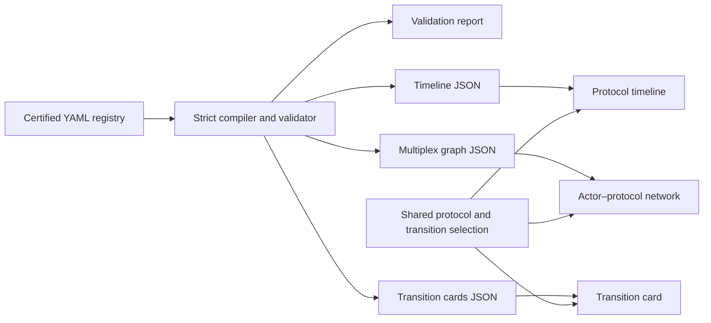

# Agentic protocol map: data, model, and representation

- Status: institutional-state registry, compiler, and coordinated views
  implemented
- Registry snapshot: `mosaic_agentic_protocol_certification_registry` version
  `0.2.0`
- Observed at: 2026-08-07
- Application route: `/agentic-protocol-map`

## Purpose

The agentic protocol map is an evidence-backed account of how protocols emerge,
change, acquire governance, gain implementations, and become institutionally
supported. It provides two coordinated readings of one certified registry:

1. a temporal view of consequential protocol events; and
2. a temporal multiplex graph of typed actor–protocol relations.

The two views answer different questions without creating different facts.

- The timeline asks: **How did each protocol move from proposal to
  implementation, governance, and institutional consolidation?**
- The graph asks: **Who exercises which kind of relation to each protocol, and
  how does that structure change over time?**

The source of truth is the checked-in
[`agentic_protocol_certification_registry.yaml`](../agentic_registry/data/agentic_protocol_certification_registry.yaml).
Neither renderer reads or interprets this YAML. The shared
[`compiler.py`](../agentic_registry/compiler.py) owns all semantic decisions and
emits renderer-specific JSON under [`agentic_registry/generated`](../agentic_registry/generated).



This boundary is interpretive, not merely technical. A visual component may
filter, style, and select compiler records, but it may not promote a weak claim,
change a relation type, invent a date, merge relation layers, or resolve an
identity.

The current `0.2.0` registry adds explicit institutional regimes and transitions
to the event, relation, and genealogy views. References to `0.1.0` below explain
the migration from the previous event-centred contract.

## Taxonomy and defined terms

The following definitions are normative for the registry, compiler, and both
representations. They describe what a term means **in this map**. They are not
claims that every protocol community uses the same vocabulary. Where public
sources use broader or ambiguous language, the registry records only the
narrowest meaning established by the evidence.

### Core analytical objects

| Term                   | Definition and boundary                                                                                                                                                                                                                                                             |
| ---------------------- | ----------------------------------------------------------------------------------------------------------------------------------------------------------------------------------------------------------------------------------------------------------------------------------- |
| **Agentic protocol**   | A publicly specified convention through which software agents, models, tools, services, or payment systems exchange messages, context, authority, requests, or value. Inclusion does not imply that the protocol is a formal standard or that participating systems are autonomous. |
| **Protocol family**    | The continuing identity under which compatible or historically connected specifications and releases are treated as one protocol. A family may contain many versions without those versions becoming separate protocol nodes.                                                       |
| **Protocol version**   | A dated specification state belonging to one protocol family. Version progression is not a merger, governance transfer, or new protocol unless the registry contains separate evidence for that change.                                                                             |
| **Functional layer**   | The principal problem a protocol addresses in this map: tool context, agent communication, delegated authority, commerce, or machine payment. It classifies protocols, not actor relations.                                                                                         |
| **Actor**              | A named company, foundation, standards body, open-source project, university, public institution, or other admitted organisation that has an evidenced relation to a protocol. A product name or informal group becomes an actor only when the registry gives it a stable identity. |
| **Event**              | A dated, evidenced change in a protocol's technical, institutional, or operational history. An event is a historical claim, not automatically a relation or a persistent state.                                                                                                     |
| **Relation**           | A typed assertion connecting an actor to a protocol over a declared validity interval. The type states the nature of the connection; it is not inferred from proximity, publicity, or organisational membership.                                                                    |
| **Protocol genealogy** | Directed historical relations between protocol families, such as merger, supersession, extension, or interoperability. Genealogy is separate from the actor–protocol multiplex.                                                                                                     |
| **Certification**      | Admission of a record to the rendered map after identifier, reference, date, evidence, and interpretation checks pass. Certification means that the public-source claim satisfies this registry's rules; it is not an endorsement of the protocol.                                  |
| **Frontier candidate** | A protocol-like initiative held outside certified views while its identity, scope, evidence bundle, or admission gates remain incomplete. Candidate status is neither rejection nor certification.                                                                                  |

### Institutional authority and work

| Term                             | Definition and boundary                                                                                                                                                                                                                                                                                                                                        |
| -------------------------------- | -------------------------------------------------------------------------------------------------------------------------------------------------------------------------------------------------------------------------------------------------------------------------------------------------------------------------------------------------------------- |
| **Authorship**                   | Evidenced responsibility for originating or co-developing a protocol or specification. Authorship does not by itself confer present stewardship, governance authority, maintenance responsibility, or ownership.                                                                                                                                               |
| **Originator**                   | An actor evidenced as introducing the protocol family or its initial public specification. The compiler must not infer that an originator remains its steward.                                                                                                                                                                                                 |
| **Stewardship**                  | Formal custodial responsibility for some declared set of protocol assets or institutional functions. Those may include the specification, repositories, SDKs, trademarks, release process, or governance infrastructure. Stewardship is not ownership, authorship, maintenance, governance, or implementation unless those relations are separately evidenced. |
| **Current steward**              | The actor or body whose evidenced stewardship interval is open at the registry observation date. `Current` is observation-relative and does not imply permanence or exclusive control.                                                                                                                                                                         |
| **Stewardship regime**           | A time-bounded state describing which actors exercise stewardship, in which roles, over which assets, and under which conditions. Regimes are the authoritative source for stewardship rails, current-steward fields, and stewardship graph edges.                                                                                                             |
| **Transfer of stewardship**      | An operation that closes or changes one stewardship regime and opens another. It records before and after regimes, mechanism, affected assets, continuities, conditions, and evidence. Announcement and completion dates remain distinct when transfer is a process rather than a point.                                                                       |
| **Governance**                   | The institutional process by which admissible changes, releases, policies, appointments, or disputes are proposed and decided. Governance concerns decision rights and procedures; it is distinct from the location in which assets are stewarded.                                                                                                             |
| **Governance regime**            | A time-bounded configuration of governing bodies, instruments, participation rules, decision procedures, and their scope. A governance regime may change without a stewardship transfer, and stewardship may move without all governance rules changing.                                                                                                       |
| **Governance adoption**          | The effective introduction or formal adoption of a governance instrument or decision procedure. It is represented as an institutional transition, not as evidence that a new steward has appeared.                                                                                                                                                             |
| **Repository control**           | Evidenced administrative control of a canonical source repository, including permissions or release infrastructure where stated. Repository control may remain with an originator after specification stewardship moves elsewhere.                                                                                                                             |
| **Technical maintenance regime** | A time-bounded allocation of responsibility for maintaining specifications, repositories, SDKs, or implementations. It is parallel to stewardship, governance, and repository control rather than a weaker stage of them.                                                                                                                                      |
| **Regime participant**           | An actor participating in a regime with an explicit role, such as `institutional_home`, `governing_project`, `repository_controller`, or `technical_maintainer`. Participants in one regime are not treated as competing overlapping regimes.                                                                                                                  |
| **Governing body**               | The organisation or constituted body with evidenced authority under the applicable governance instrument. Hosting a repository, employing maintainers, or belonging to a foundation does not alone establish governing-body status.                                                                                                                            |
| **Technical steering committee** | A formally identified group with an evidenced technical direction or decision role. An informal maintainer list is not promoted to a steering committee.                                                                                                                                                                                                       |
| **Voting organisation**          | An actor that holds a formally evidenced vote or voting seat in a protocol's governance. Foundation membership, attendance, sponsorship, or endorsement does not imply a vote.                                                                                                                                                                                 |
| **Named representative**         | A natural person explicitly appointed or listed in a defined governance or steering role. Employment by a participating organisation is not sufficient.                                                                                                                                                                                                        |
| **Appointment interval**         | The half-open period during which a named representative or organisation is evidenced to hold an appointed role. A missing end means no closing bound was recorded as of observation, not a permanent appointment.                                                                                                                                             |
| **Decision procedure**           | The documented mechanism by which proposals are accepted, rejected, amended, escalated, or released—for example maintainer consensus, a vote, or a specified proposal process. A repository contribution guide is not assumed to be the complete decision procedure.                                                                                           |
| **Governance instrument**        | The charter, bylaws, proposal process, maintainer policy, committee terms, or comparable document that constitutes decision rights and procedures.                                                                                                                                                                                                             |
| **Maintenance**                  | Ongoing technical work that keeps a protocol specification, repository, SDK, or reference implementation usable and current. Maintenance does not by itself establish governance or stewardship.                                                                                                                                                               |
| **Maintainer**                   | An actor or named person explicitly evidenced as performing maintenance or holding a maintainer role for a declared interval. Code contribution alone does not establish maintainer status.                                                                                                                                                                    |
| **Maintainer interval**          | The half-open period during which a maintenance role is evidenced. It describes responsibility over time, rather than the date of a single contribution.                                                                                                                                                                                                       |
| **Institutional transition**     | An evidenced operation between institutional states, expressed as **before → operation → after** and linked to its chronological event. Transfers, governance adoptions, and protocol mergers require transition semantics; they must not be reduced to context-free points.                                                                                   |
| **Mechanism**                    | The evidenced institutional operation that produces a transition, such as donation, contribution to a foundation, charter adoption, committee formation, or merger. It should reproduce the source's institutional meaning without upgrading it.                                                                                                               |
| **Asset scope**                  | The explicit assets or functions affected by a transition: specification, repository, SDK, trademark, release process, governance process, or another declared subset. The transfer of one asset must not be displayed as transfer of the whole protocol.                                                                                                      |
| **Partial transfer**             | A transition in which different assets have different outcomes. Each asset is marked as transferred, retained by the originator, unchanged, or unresolved; institutional hosting is never treated as complete technical control.                                                                                                                               |
| **Interval-censored transition** | A transition known to have progressed between two dates but lacking one defensible effective day. The timeline represents the interval as uncertainty rather than selecting an arbitrary boundary.                                                                                                                                                             |
| **Continuity / discontinuity**   | What remains materially unchanged across a transition, and what changes. These fields distinguish a new institutional home from changes to compatibility, maintainers, decision rights, access, or protocol identity.                                                                                                                                          |

### Technical uptake, public support, and institutional association

| Term                           | Definition and boundary                                                                                                                                                                                                        |
| ------------------------------ | ------------------------------------------------------------------------------------------------------------------------------------------------------------------------------------------------------------------------------ |
| **Implementation**             | Executable software that realises part or all of a protocol. A specification, SDK announcement, code contribution, or integration claim is not automatically an independent implementation.                                    |
| **Reference implementation**   | An implementation explicitly designated by an authoritative protocol source as the reference against which behaviour may be understood or tested.                                                                              |
| **Independent implementation** | An evidenced implementation maintained outside the protocol's originating or canonical implementation project. Independence refers to the implementation lineage, not necessarily to organisational or financial independence. |
| **Integration**                | An evidenced technical connection through which a product, service, framework, or protocol uses or exposes another protocol. Integration does not establish governance, stewardship, or production deployment.                 |
| **Adoption**                   | Evidenced operational use of a protocol by an actor. The map uses specific relation types—especially integration and verified production deployment—instead of converting every support announcement into adoption.            |
| **Production deployment**      | Evidence that a protocol is operating in a live, non-demo environment. A roadmap, preview, test, example, or launch announcement does not establish production deployment.                                                     |
| **Endorsement**                | A public expression of approval or alignment that does not establish implementation, adoption, funding, governance, or maintenance.                                                                                            |
| **Announced support**          | A stated intention or declared compatibility claim whose operational realisation has not been independently established in the registry. It remains in the endorsement layer.                                                  |
| **Funding**                    | An evidenced provision of money or material resources directed to the protocol or its work. Corporate participation, employment, membership, and sponsorship are not converted into funding without a specific claim.          |
| **Convening**                  | Institutional participation that brings actors into a shared forum, foundation, working group, or programme. Convening does not imply a vote, implementation, endorsement, funding, or control.                                |
| **Foundation membership**      | An actor's evidenced membership in a foundation associated with a protocol. It is represented as convening unless a separate record establishes a vote or another stronger relation.                                           |

### Lifecycle and genealogy operations

| Term                            | Definition and boundary                                                                                                                                                                                                                                                                                              |
| ------------------------------- | -------------------------------------------------------------------------------------------------------------------------------------------------------------------------------------------------------------------------------------------------------------------------------------------------------------------- |
| **Public launch**               | The first evidenced public presentation or release of a protocol family. Earlier private work may exist but is not placed on the public timeline without admissible evidence.                                                                                                                                        |
| **Major specification release** | A consequential, dated specification publication selected for the primary timeline. Minor and patch releases remain accessible as ticks or supplemental records.                                                                                                                                                     |
| **Merger**                      | A directed protocol-family transition in which one or more source protocols are incorporated into, consolidated with, or continued through a target protocol. It is not movement from one version to another and does not by itself mean corporate acquisition. In this registry, ACP → A2A is the certified merger. |
| **Archival**                    | A documented change to inactive or read-only historical status. Archival ends an active lifeline but does not erase the protocol, its versions, relations, or evidence from historical views.                                                                                                                        |
| **Deprecation**                 | An authoritative indication that a protocol or version should no longer be used or is scheduled for retirement. Deprecation can precede archival and does not necessarily identify a successor.                                                                                                                      |
| **Supersession**                | A directed claim that one protocol or version replaces another for a declared scope. The superseded object remains in historical views.                                                                                                                                                                              |
| **Extension**                   | A directed claim that one protocol adds behaviour or scope to another while retaining distinct identity. Extension is not merger or supersession.                                                                                                                                                                    |
| **Interoperability**            | An evidenced ability or designed pathway for distinct protocols or implementations to work together. Interoperability does not imply shared governance, compatibility in every version, or common stewardship.                                                                                                       |
| **Migration path**              | The documented process by which users, implementations, or assets move from a source protocol to a target after merger, supersession, or deprecation.                                                                                                                                                                |
| **Compatibility effect**        | The evidenced consequence of a transition or release for implementations or versions: preserved, bridged, conditionally compatible, broken, or not recorded.                                                                                                                                                         |

### Temporal and evidentiary terms

| Term                         | Definition and boundary                                                                                                                                                                                            |
| ---------------------------- | ------------------------------------------------------------------------------------------------------------------------------------------------------------------------------------------------------------------ |
| **Temporal multiplex graph** | A graph with stable actor and protocol nodes and multiple non-collapsed relation layers whose edges are active only during their validity intervals. Time, relation type, and evidence remain explicit dimensions. |
| **Multiplex layer**          | One semantic class of actor–protocol relation: authorship, governance, maintenance, implementation, adoption, funding, endorsement, or convening. Layers are filterable views, not weights to be summed.           |
| **Validity interval**        | The half-open interval `[valid_from, valid_to)` during which a relation or regime is evidenced as active. It describes the claim's temporal scope, not the lifespan of its source document.                        |
| **Open relation**            | A relation with `valid_to: null`, meaning that no closing bound was recorded as of the observation date. It does not assert perpetual validity.                                                                    |
| **Observation date**         | The date through which the registry snapshot claims to have checked and represented evidence. It bounds open timeline lifelines and the meaning of `current`.                                                      |
| **Date precision**           | The declared granularity—day, month, year, or unknown—at which a date is supported. Reduced precision must remain visible and must not be converted into false day-level certainty.                                |
| **Evidence claim**           | The exact event, relation, regime, or transition assertion being supported. A displayed claim must resolve to at least one admissible source.                                                                      |
| **Evidence source**          | A reusable bibliographic and access record for a source supporting one or more claims. A source's existence does not license claims beyond what it directly establishes.                                           |
| **Evidence state**           | The character of support for a claim: independently verified, primary verified, announced, or inferred. It is not a measure of importance.                                                                         |
| **Confidence**               | The registry's assessment of how unambiguously the available evidence establishes the typed identity, relation, date, or transition. Confidence does not upgrade the evidence state.                               |
| **Unknown**                  | A field for which the certified registry has no adequate value. Unknown is displayed as a data condition and must not be silently inferred.                                                                        |
| **Disputed**                 | A field for which admissible sources support incompatible interpretations or dates. The competing claims and their evidence must remain visible until resolved.                                                    |

## Data model

### Registry collections

Version `0.2.0` retains six principal collections and two adjunct collections,
then adds two institutional-state collections. The principal collections remain
independently useful; regimes replace only duplicated stewardship and governance
state.

| Analytical collection              | Registry representation                             | Role                                                                                                                                                                                                              |
| ---------------------------------- | --------------------------------------------------- | ----------------------------------------------------------------------------------------------------------------------------------------------------------------------------------------------------------------- |
| Protocols                          | `protocols`                                         | Canonical identity, acronym, scope, functional layer, licence, repository, status, and certification result. The `0.1.0` steward field is migrated to a compiler-derived value in `0.2.0`.                        |
| Protocol versions                  | `protocol_versions`                                 | Version label, publication date and precision, stability, specification URL, compatibility, supersession, and evidence references.                                                                                |
| Protocol events                    | `protocol_events`                                   | Launches, releases, governance changes, transfers, mergers, deployments, and archival events.                                                                                                                     |
| Actors                             | `actors`                                            | Companies, foundations, standards bodies, open-source projects, universities, and public institutions, with optional parent identity.                                                                             |
| Actor–protocol relations           | `actor_protocol_relations`                          | Typed, time-bounded relations between one actor and one protocol, with evidence state and confidence.                                                                                                             |
| Evidence claims                    | `evidence_sources` plus record-level `evidence_ids` | A claim is the event summary or typed relation in its record; `evidence_ids` resolve that claim to one or more primary-source records. The compiler emits the exact claim and its resolved source cards together. |
| Protocol genealogy (adjunct)       | `protocol_protocol_relations`                       | `MERGED_INTO`, `SUPERSEDES`, `EXTENDS`, and `INTEROPERATES_WITH` relations retained as a separate optional overlay.                                                                                               |
| Frontier admission queue (adjunct) | `frontier_candidates`                               | Candidates held outside certified views until the required gates and evidence pass.                                                                                                                               |

Version `0.2.0` adds two institutional-state collections:

| Collection             | Role                                                                                                                  |
| ---------------------- | --------------------------------------------------------------------------------------------------------------------- |
| `protocol_regimes`     | Authoritative, time-bounded stewardship, governance, repository-control, and technical-maintenance states.            |
| `protocol_transitions` | Evidence-backed operations connecting before and after regimes, linked to but not duplicated by chronological events. |

Regimes are the single source of truth for institutional state:

\[
\texttt{protocol_regimes}
\longrightarrow
\begin{cases}
\text{derived current-steward fields},\\
\text{derived stewardship and governance graph edges},\\
\text{timeline institutional rails}.
\end{cases}
\]

Consequently, `STEWARDED_BY` and `GOVERNED_BY` are not independently authored
in `0.2.0`. Origin, implementation, voting-seat, deployment, and other relations
remain independently authored because they assert different facts.

### Institutional-state schema (`0.2.0`)

Stewardship, governance, repository control, and technical maintenance are four
parallel state variables:

```yaml
protocol_regimes:
    - id: regime_a2a_lf_stewardship
      protocol_id: protocol_a2a
      regime_type: stewardship
      status: verified
      participants:
          - actor_id: org_linux_foundation
            role: institutional_home
          - actor_id: org_a2a_project
            role: governing_project
      valid_from: 2025-06-23
      valid_to: null
      asset_scope: [specification, sdk, tooling]
      evidence_ids: [src_a2a_lf_launch]
```

The participant role is mandatory. Multiple actors may participate in one
regime without creating conflicting regimes. Overlap is validated by semantic
scope, not by protocol alone:

\[
(\text{protocol},\ \text{regime type},\ \text{asset scope}).
\]

Two regimes conflict only when their time intervals overlap within the same
triple and the records do not explicitly describe one joint regime. For this
check, an `asset_scope` list is expanded into one comparison key per asset. Gaps
are represented by an `unknown` regime rather than silently filled from
authorship or organisational association.

A transition is a separate state-change record linked to its event:

```yaml
protocol_transitions:
    - id: transition_a2a_lf
      event_id: evt_a2a_lf_transfer
      kind: stewardship_transfer
      from_regime_ids: [regime_a2a_google_stewardship]
      to_regime_ids: [regime_a2a_lf_stewardship]
      announced_at: 2025-06-23
      effective_date: 2025-06-23
      effective_interval: null
      completion_confirmed_at: 2025-06-23
      mechanism: contribution
      transfer_effect:
          - asset: specification
            effect: transferred
          - asset: sdk
            effect: transferred
          - asset: tooling
            effect: transferred
      governance_instrument: null
      decision_rules: null
      participation_conditions: null
      access_conditions: null
      continuities: []
      discontinuities: []
      evidence_ids: [src_a2a_lf_launch]
```

The event remains the chronological fact; the transition explains how
institutional state changed. This separation permits one transition to affect
several protocol lanes while preserving one shared selection identity.

An uncertain effective date is represented as an interval, never replaced by
an invented day:

```yaml
announced_at: 2026-04-02
effective_date: null
effective_interval:
    from: 2026-04-02
    to: 2026-07-14
completion_confirmed_at: 2026-07-14
date_precision: interval
```

Partial transfers use one `transfer_effect` entry per asset. Allowed effects
distinguish at least `transferred`, `retained_by_originator`, `unchanged`, and
`unresolved`. Thus AP2 can record movement of its normative specification and
standards process without implying that repository control or implementation
maintenance moved with them.

The `0.2.0` compiler owns controlled vocabularies rather than accepting
renderer-specific labels:

| Field              | Initial controlled values                                                                                                                                            |
| ------------------ | -------------------------------------------------------------------------------------------------------------------------------------------------------------------- |
| `regime_type`      | `stewardship`, `governance`, `repository_control`, `technical_maintenance`                                                                                           |
| participant `role` | `institutional_home`, `governing_project`, `governing_body`, `repository_controller`, `technical_maintainer`, `originator_custodian`, `project_custodian`, `unknown` |
| transition `kind`  | `stewardship_transfer`, `governance_adoption`, `protocol_merger`, `regime_termination`                                                                               |
| `mechanism`        | `donation`, `contribution`, `charter_adoption`, `committee_formation`, `merger`, `archival`, `other_declared`                                                        |
| asset `effect`     | `transferred`, `retained_by_originator`, `unchanged`, `unresolved`                                                                                                   |
| regime `status`    | `verified`, `announced`, `unknown`, `disputed`                                                                                                                       |

Any additional value requires a schema change; visual renderers may rename a
value for display but may not reinterpret it.

### Migration from `0.1.0`

The migration follows four rules:

1. Existing events remain chronological records and receive transition links
   only where the evidence establishes a state change.
2. Authored current-steward fields and independently authored `STEWARDED_BY` or
   `GOVERNED_BY` edges are replaced by regime-derived projections.
3. Originators are not promoted to initial stewards. If stewardship evidence is
   insufficient, the period becomes an explicit `unknown` regime.
4. Existing non-institutional relations and protocol genealogy remain authored
   records with stable identifiers.

The first complete migration fixture is A2A. Renderer work begins only after
that fixture passes reference, interval, derivation, and evidence tests. MCP,
AP2, ACP, x402, and UCP then exercise progressively more difficult cases:
governance preceding stewardship, partial transfer, merger, interval-censored
transfer, and unknown state.

The registry deliberately stores reusable source descriptions separately from
the claims they support. This is a normalised evidence model:

\[
\text{claim record}\;c \xrightarrow{\texttt{evidence_ids}}
\{s_1,\ldots,s_n\}.
\]

At compilation time, each displayed event or edge carries both its exact claim
and the resolved source cards. Therefore the display invariant is:

\[
\forall c \in C\_{\mathrm{displayed}},\quad
\exists s \in S:\operatorname{supports}(s,c)
\land \operatorname{url}(s)\neq\varnothing.
\]

The current certified snapshot contains 6 protocols, 21 protocol versions, 23
events, 41 actors, 52 independently authored actor–protocol relations, 34
institutional regimes, 6 transitions, 7 genealogy relations, and 46 evidence
sources. Five frontier candidates remain outside the certified views. The
compiler adds regime-derived institutional edges without changing the authored
relation count.

### Identity and references

All records have stable, globally unique identifiers. Every reference must
resolve to an admitted record of the expected kind. Labels are presentation
fields resolved by the compiler; renderers use identifiers for selection and
joins.

The compiler rejects:

- duplicate YAML mapping keys;
- missing, malformed, repeated, or globally colliding identifiers;
- references to missing actors, protocols, versions, events, relations, or
  sources;
- unknown controlled-vocabulary values;
- incomplete certification-gate structures; and
- displayed claims without at least one direct source URL.

### Dates and uncertainty

Dates are represented as an authored value and an explicit precision:
`day`, `month`, `year`, or `unknown`. The compiler derives a half-open display
interval where needed.

| Authored date | Precision | Normalised representation                                     |
| ------------- | --------- | ------------------------------------------------------------- |
| `2026-04-28`  | day       | start at that day; point unless the record has a separate end |
| `2025-05`     | month     | `[2025-05-01, 2025-06-01)`                                    |
| `2025`        | year      | `[2025-01-01, 2026-01-01)`                                    |
| unresolved    | unknown   | excluded from the chronological axis and listed off-axis      |

An event date is the date the change happened or took effect. `published_at` is
the source publication date. `observed_at` is the date the registry checked the
source. These dates are not substituted for one another.

### Evidence state and confidence

Evidence state and confidence remain separate dimensions.

- Evidence state describes the kind of support: `independently_verified`,
  `primary_verified`, `announced`, or `inferred`.
- Confidence describes how unambiguously the evidence establishes the typed
  actor, relation, and date: `high`, `medium`, or `low`.

Neither is converted into a generic weight. A high-confidence announcement is
still an announcement; it does not become adoption or governance.

### Governance surface

Every compiled protocol exposes the same governance interface:

- governing body;
- technical steering committee;
- voting organisations;
- named representatives;
- appointment intervals;
- maintainer intervals;
- decision procedure; and
- transfer of stewardship.

The compiler derives only what is explicitly asserted by regimes, transitions,
or independently authored typed records:

| Governance field        | Admitted source                                                   |
| ----------------------- | ----------------------------------------------------------------- |
| Governing body          | Participants in governance regimes                                |
| Voting organisations    | `HOLDS_VOTING_SEAT` relations                                     |
| Maintainer intervals    | `MAINTAINS` relations and their validity intervals                |
| Decision procedure      | Decision rules in governance regimes                              |
| Transfer of stewardship | `stewardship_transfer` transitions linked to events               |
| Governance evidence     | Evidence attached to the protocol's governance certification gate |

The remaining fields are present as empty arrays or `null` until the registry
contains an explicit compatible record. Empty means **not recorded in the
certified registry**, not “known not to exist”. A governance URL, foundation
membership, source title, or launch announcement is never mined to invent a
committee, representative, appointment, or decision procedure.

Governing-body and current-steward fields are derived from active regimes.
Voting seats, named appointments, and other independently evidenced roles remain
separate relations. In particular, MCP's governance adoption on 31 July 2025
and stewardship transfer on 9 December 2025 are two independent state changes.

## Temporal multiplex graph model

### Nodes

Let

\[
V = V_A \sqcup V_P,
\]

where \(V_A\) is the set of actor nodes and \(V_P\) is the set of protocol
nodes. The union is disjoint: an open-source project that stewards a protocol is
still an actor node, not the protocol itself.

Actor attributes include `actor_type`, optional `parent_id`, display label,
column, and a compiled fixed position. Protocol attributes include functional
layer, lifecycle status, certification verdict, governance surface, and fixed
position.

### Layers

The multiplex layer set is

\[
\mathcal L = \{\text{authorship},\text{governance},\text{maintenance},
\text{implementation},\text{adoption},\text{funding},
\text{endorsement},\text{convening}\}.
\]

Each relation type maps to exactly one layer.

| Layer          | Relation types                                                                                     |
| -------------- | -------------------------------------------------------------------------------------------------- |
| Authorship     | `ORIGINATED`, `CO_DEVELOPED`                                                                       |
| Governance     | `DONATED_TO`, `STEWARDED_BY`, `GOVERNED_BY`, `HOLDS_VOTING_SEAT`, `CHAIRS`                         |
| Maintenance    | `MAINTAINS`                                                                                        |
| Implementation | `CONTRIBUTES_CODE`, `PUBLISHES_SDK`, `REFERENCE_IMPLEMENTS`, `INDEPENDENTLY_IMPLEMENTS`, `EXTENDS` |
| Adoption       | `INTEGRATES`, `DEPLOYS_IN_PRODUCTION`                                                              |
| Funding        | `FUNDS`                                                                                            |
| Endorsement    | `ENDORSES`, `ANNOUNCES_SUPPORT_FOR`                                                                |
| Convening      | `MEMBER_OF_STEWARD`                                                                                |

In `0.2.0`, `STEWARDED_BY` and `GOVERNED_BY` are compiled projections of active
regimes. They remain visible edge types but no longer duplicate authored state.
The other relation types remain authored claims.

The map is not a weighted projection. In particular:

- announced support does not become governance or adoption;
- foundation membership does not become implementation, funding, a vote, or
  endorsement;
- code contribution does not establish an organisation's policy; and
- a large narrative neighbourhood does not establish institutional influence.

### Edges

An actor–protocol edge is

\[
e=(i,a,p,r,\ell,[t*{from},t*{to}),q,c,S),
\]

where:

- \(i\) is the stable relation identifier;
- \(a\in V_A\) and \(p\in V_P\);
- \(r\) is the controlled relation type;
- \(\ell\in\mathcal L\) is its compiler-assigned multiplex layer;
- \([t*{from},t*{to})\) is its validity interval;
- \(q\) is the evidence state;
- \(c\) is confidence; and
- \(S\) is the non-empty set of resolved supporting sources.

An open relation must explicitly declare `valid_to: null`. Null means “no
recorded closing bound as of observation”, not permanence.

For a selected date \(t\), the active edge set in layer \(\ell\) is

\[
E*{\ell}(t)=\{e\mid e.\ell=\ell\land
t*{from}(e)\leq t<t\_{to}(e)\},
\]

with the upper comparison omitted for open intervals. The application evaluates
this predicate independently for every edge. Changing the layer or date changes
the visible edge set, not node identities or positions.

### Genealogy is separate

Protocol–protocol genealogy is a directed overlay between nodes in \(V_P\). It
does not belong to the actor–protocol multiplex and is off by default. This
keeps supersession, extension, interoperability, and merger from being confused
with institutional relations.

Superseded protocols remain as historical nodes and timeline participants. A
status change suppresses neither the protocol nor its earlier relations.

## Graph representation

The graph uses a constrained, deterministic bipartite layout:

- protocol nodes occupy a stable central column;
- company actors occupy the left column;
- foundations, standards bodies, projects, universities, and public
  institutions occupy the right column;
- actors are ordered deterministically, with parent identifiers considered on
  the institutional side; and
- node coordinates do not move when filters change.

The stable layout preserves visual memory. Node size does not encode generic
influence. The selected node's neighbourhood is instead reported by active
layer, which makes the scope of any degree-like count explicit.

The default view contains relations with operational or institutional force:
originated, co-developed, stewarded, governed, voting seat, maintained,
reference or independent implementation, integration, and verified production
deployment. Endorsement, announced support, funding, convening, and other layers
remain available through the layer control rather than being silently discarded.

The renderer supports protocol, actor-type, date, layer, confidence, and
genealogy controls. Selecting an edge exposes its exact typed claim, validity
interval, evidence state, confidence, and sources. Selecting a node exposes its
active neighbourhood separated by layer; protocol selection also exposes the
complete governance surface.

In `0.2.0`, selecting a transition evaluates both views at the same date or
effective interval. The compiler closes old derived institutional edges, opens
new ones, and preserves unaffected technical relations. The graph highlights
the resulting neighbourhood but does not calculate the state change itself.

The graph is rendered with a repository-vendored Cytoscape.js bundle. It
consumes only [`graph.json`](../agentic_registry/generated/graph.json).

## Timeline representation

The timeline consumes only
[`timeline.json`](../agentic_registry/generated/timeline.json). Version 2 uses
one shared temporal field and one horizontal lane per protocol, in the fixed
conceptual order MCP, A2A, ACP, AP2, UCP, and x402. Each lane carries its
functional subtitle: tool context, agent communication, delegated authority,
commerce, or machine payment. The compiler owns both the order and protocol
lifelines.

The common axis ends at the registry observation date. Active protocol
lifelines end at that boundary; ACP's lifeline closes at its certified merger
into A2A. This makes simultaneity and consolidation visible without projecting
future time.

The `0.2.0` timeline separates technical history from institutional state inside
each existing lane:

1. the main lifeline carries launches, major specifications, deployments,
   archival, and other technical lifecycle events;
2. the stewardship rail shows time-bounded stewardship regimes; and
3. governance instruments appear as markers or thin secondary segments.

Verified regimes use solid segments. Unknown or disputed regimes use visibly
uncertain styling. Point-effective transfers use boundary arrows; transitions
known only within an interval use shaded or hatched bands. Specifications remain
secondary and minor releases remain ticks.

A protocol merger is a directed genealogy operation, not a point-shaped event.
ACP's lifeline terminates on 27 August 2025, a directed connector enters A2A,
and an archival square remains on ACP. All three marks resolve to one shared
transition selection.

Colour reinforces event type but is not the sole encoding. Consequential events
receive compact direct labels. Month- and year-level dates are range marks with
reduced certainty styling. Unknown dates remain in an off-axis unresolved list.
Minor and patch releases remain available in a supplemental table, so one
protocol's release cadence cannot dominate the historical comparison.

Selecting a technical event opens its evidence card. Selecting an institutional
operation opens a transition card with:

- before regime and participant labels;
- operation, mechanism, scope, and dates;
- after regime and participant labels;
- transferred, retained, unchanged, and unresolved assets;
- governance, decision, and participation conditions where recorded;
- continuities, discontinuities, and missing fields; and
- exact evidence claims and direct sources.

Primary cards display resolved labels rather than raw actor identifiers.

## Timeline renderer comparison and Version 2 decision

Two similarly named packages were considered. They are not interchangeable.

| Criterion                 | [`streamlit-timeline`](https://pypi.org/project/streamlit-timeline/) | [`streamlit-vis-timeline`](https://pypi.org/project/streamlit-vis-timeline/)                       |
| ------------------------- | -------------------------------------------------------------------- | -------------------------------------------------------------------------------------------------- |
| Underlying library        | Knight Lab TimelineJS                                                | vis-timeline                                                                                       |
| Primary orientation       | Linear, media-rich historical storytelling                           | Interactive analytical comparison on a time axis                                                   |
| Python API                | `timeline(data, height=...)` using TimelineJS JSON                   | `st_timeline(items, groups, options, height, key)`                                                 |
| Group/lane contract       | TimelineJS narrative grouping                                        | Explicit item-to-group membership and group objects                                                |
| Temporal marks            | TimelineJS events and eras                                           | Point, box, range, and background items                                                            |
| Styling and behaviour     | Wrapper exposes a small fixed interface                              | Passes item fields and timeline options, including classes, styles, selection, zoom, and scrolling |
| Streamlit return value    | The wrapper source returns a static HTML component                   | Returns the selected item to Python                                                                |
| Evidence-card interaction | Would require a new custom bridge                                    | Supported by the component's bidirectional selection                                               |

### Why `streamlit-vis-timeline` was the stronger candidate

The choice follows from the analytical contract, not aesthetic preference.

1. **Lanes are part of the model.** vis-timeline accepts explicit groups and
   item membership. Its documentation describes groups as the vertical axis for
   putting related items on the same line.
2. **Uncertainty needs intervals.** vis-timeline items accept `start` and `end`,
   so month- and year-precision claims can occupy their full normalised interval
   rather than masquerading as a point on the first day.
3. **Event classes need redundant encoding.** Per-item content, class, style,
   and item type support glyph, colour, border, opacity, point, and range
   distinctions.
4. **The evidence card needs a selection identity.** The package advertises
   bidirectional communication and returns the selected item. The renderer maps
   its numeric adapter identifier back to the compiler-owned event identifier.
5. **Simultaneous histories need navigation.** vis-timeline exposes zoom,
   horizontal scrolling, selectable items, explicit bounds, and stacking
   options appropriate to comparative analysis.

The [vis-timeline documentation](https://visjs.github.io/vis-timeline/docs/timeline/)
documents grouped data, interval items, item styling, zooming, and selection
events. The [`streamlit-vis-timeline` package page](https://pypi.org/project/streamlit-vis-timeline/)
documents its bidirectional component API and selected-item return value.

### Why not `streamlit-timeline`

`streamlit-timeline` is a useful wrapper when the desired object is a narrated,
slide-like history with text and media. Its package interface accepts a
TimelineJS JSON document and a height. Its
[`timeline()` implementation](https://github.com/innerdoc/streamlit-timeline/blob/main/streamlit_timeline/__init__.py)
constructs a static TimelineJS embed and returns Streamlit's static HTML
component; it does not return a selected event identity to Python.

That is the wrong interaction boundary for this instrument. The page must use a
selection to retrieve an exact compiler claim and show its evidence below the
axis. Reimplementing that bridge would effectively mean maintaining a custom
component while retaining a narrative-oriented data contract.

### Version 2 implementation decision

The current renderer preserves the `0.1.0` single-axis geometry while using the
`0.2.0` institutional-state contract for rails, transition bands, and the
cross-lane connector.

Version 1 used `streamlit-vis-timeline` because its data model was the better of
the two wrappers. In the tested combination of `streamlit-vis-timeline` 0.3.0
and Streamlit 1.55, however, the grouped component rendered group rows while
dropping all foreground events and release ticks. The only wrapper-level
workaround was one component per lane, which fragmented the visual field and
made the apparent scales diverge.

Version 2 therefore uses the application's existing Plotly runtime for the
timeline renderer. This is an intentional renderer change, not a semantic
change. It provides:

- one figure and one x-axis for all six protocols;
- an exact observation-date endpoint;
- fixed protocol order and stable functional lane labels;
- compiler-owned lifelines, including ACP's merger endpoint;
- stewardship rails and governance instrument markers;
- point-effective arrows and interval-censored transition bands;
- a directed ACP → A2A connector with one shared transition identity;
- selectable technical-event markers with shape and direct text;
- non-selectable minor-release ticks; and
- compiler event or transition IDs returned to Streamlit for evidence or
  before/operation/after cards.

This does not make `streamlit-timeline` the preferable alternative. Its static,
narrative interaction boundary still cannot return the selected compiler event
needed by the evidence card. A future vis-based component may replace Plotly if
it renders grouped foreground items reliably and passes the same single-axis,
selection, endpoint, and lifeline acceptance tests.

## Compiler and representation invariants

The compiler is the only component allowed to interpret the registry. In
`0.2.0` it emits four coordinated artefacts:

| Artefact                 | Contents                                                                                      |
| ------------------------ | --------------------------------------------------------------------------------------------- |
| `timeline.json`          | Protocol lifelines, technical events, regime rails, transfer bands, and genealogy connectors. |
| `graph.json`             | Stable nodes plus authored and regime-derived time-bounded edges.                             |
| `transition_cards.json`  | Resolved before/operation/after cards and their evidence.                                     |
| `validation_report.json` | Counts, warnings, missing fields, safeguards, and source hash.                                |

The compiler enforces the following interpretation safeguards before a
renderer can load an artefact:

- every event refers to an admitted protocol;
- every actor–protocol relation refers to an existing actor and protocol;
- every version belongs to an existing protocol;
- every partial date declares its precision;
- every open relation explicitly has `valid_to: null`;
- every displayed event, version, relation, and genealogy edge resolves at
  least one evidence source;
- announced support remains endorsement;
- foundation membership remains convening;
- superseded certified protocols remain in historical artifacts; and
- all renderer artefacts carry the same contract version, registry identity,
  observation date, and source SHA-256.

The `0.2.0` extension additionally requires:

- every regime participant, transition, event, asset, and evidence reference to
  resolve;
- regime intervals to be half-open and gaps to be explicitly represented;
- overlap validation by protocol, regime type, and asset scope;
- complete transfers to close and open matching asset scopes;
- partial transfers to state the effect on every asserted asset;
- governance regimes to name an instrument or explicitly report it missing;
- interval-censored transitions to preserve announcement, interval, and
  completion dates without inventing an effective day;
- merger, lifeline termination, and archival dates to agree; and
- timeline and graph artefacts to yield the same institutional state at any
  selected date.

Generated artefacts are deterministic compact JSON. The
[`validation_report.json`](../agentic_registry/generated/validation_report.json)
records source counts, derived counts, warnings, safeguards, and the content
hash used to detect source/artifact drift.

## Representation limits

The map is a certified public-source snapshot, not a complete measure of power
or use.

- Absence from the registry is not proof of absence in the world.
- Named support is weaker than an implementation, deployment, vote, or
  maintenance role.
- Production claims are not comparable usage measurements.
- Governance pages may establish that a process exists without supplying every
  representative, appointment interval, or decision rule required by this
  model.
- Degree is conditional on the active layer, date, confidence threshold, and
  admission rules; it is not generic influence.
- The five frontier candidates are an admission queue, not certified protocol
  nodes.

These limits are shown as data gaps and evidence states rather than filled by
inference.

## Primary implementation references

- [`streamlit-timeline` on PyPI](https://pypi.org/project/streamlit-timeline/)
- [`streamlit-timeline` source](https://github.com/innerdoc/streamlit-timeline/blob/main/streamlit_timeline/__init__.py)
- [`streamlit-vis-timeline` on PyPI](https://pypi.org/project/streamlit-vis-timeline/)
- [`streamlit-vis-timeline` source repository](https://github.com/giswqs/streamlit-timeline)
- [`streamlit-vis-timeline` grouped demo](https://github.com/giswqs/streamlit-timeline-demo/blob/master/streamlit_app.py)
- [vis-timeline API documentation](https://visjs.github.io/vis-timeline/docs/timeline/)
- [Knight Lab TimelineJS JSON format](https://timeline.knightlab.com/docs/json-format.html)
